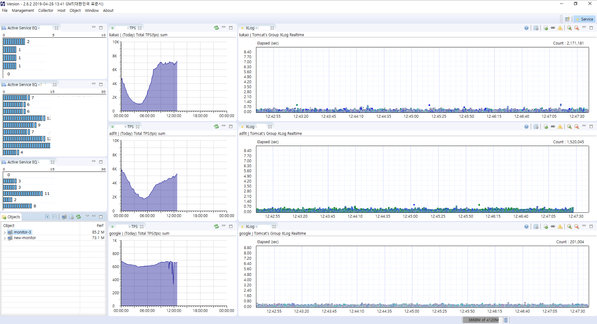

토이 프로젝트 no.1
----

주소 호출시 해당 화면을 스냅샷 찍어 텔레그램을 통해 전송할 예정입니다.  
사용 목적은 다음과 같습니다.  

텔레그램 이미지봇같은 형태로,  
 
```
xxx서버 스카우터
```

라는 명령어 입력시,  
해당 서버를 모니터링하고 있는 실제 윈도우화면을 캡쳐해 제공해주는 용도입니다.  
주소 호출시, 해당 스카우터를 띄운 윈도우의 화면을 캡쳐하여 제공합니다.  


